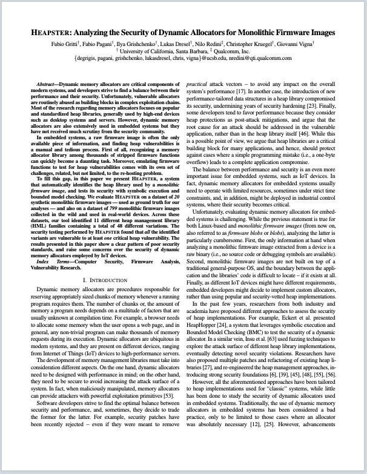
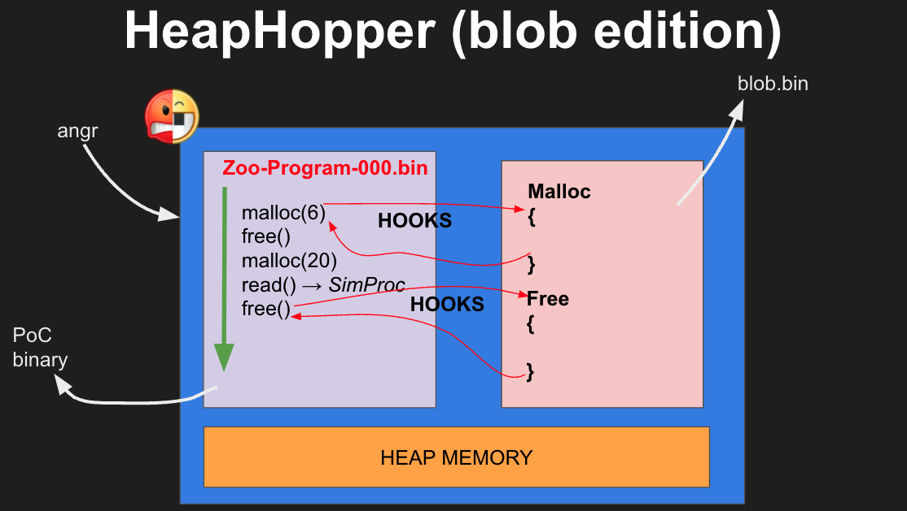

# HEAPSTER: Analyzing the Security of Dynamic Allocators for Monolithic Firmware Images
[](https://github.com/angr/angr/blob/master/LICENSE)

<a href="https://degrigis.github.io/bins/heapster.pdf">  </a>

This repository contains all the code used in our S&P2022 paper <a href="https://degrigis.github.io/bins/heapster.pdf">"Heapster: Analyzing the Security of Dynamic Allocators for Monolithic Firmware Images"</a>.
The system is able to identify a dynamic memory allocator used within a monolithic firmware image (ARMCortexM) and to test its security using symbolic execution and bounded model checking.
The project has been wrapped in a Docker container to facilitate the replicability of our findings, follow the instructions below to start to play with the analyses techniques and our datasets. 

Additional resources related to the project:
* https://github.com/ucsb-seclab/heapster-dataset-metadata: a collection of metadata regarding the firmware images in our dataset (i.e., loading configurations and many different additional information like blob entry-point, base-address, recognized functions, etc...). If you need more, or support on how to use those, don't hesitate to ping me.
* https://github.com/ucsb-seclab/monolithic-firmware-collection: a big collection of monolithic firmware images consolidated using previous research. Note that, Heapster dataset is a subset of that collection as the repo grew during time. You can find the exact list of tested blobs [here](https://github.com/ucsb-seclab/heapster/blob/master/heapster-env/fw-dataset/wild/fw-tested.txt). In this repo you can also find some [utility](https://github.com/ucsb-seclab/monolithic-firmware-collection/tree/master/utils) I wrote to [:one:] automatically spot the IVT in a random blob, and, [:two:], automatically identify the entry-point/base-address of a blob using the algorithm presented in [FirmXRay](https://github.com/OSUSecLab/FirmXRay) and reimplemented in [angr](https://github.com/angr/angr).
* https://docs.google.com/spreadsheets/d/1e6GkfeSvBavg4e9e-mgUuTfPj4It9WYItkNG7xG1G2g/edit?usp=sharing: comprehensive metadata regarding our firmware clusterization and stats of the tool.

If you use HEAPSTER in a scientific publication, we would appreciate a citation using this Bibtex entry: 

```
@inproceedings{gritti_heapster_22,
 author    = {Fabio Gritti and Fabio Pagani and Ilya Grishchenko and Lukas Dresel and Nilo Redini and Christopher Kruegel and Giovanni Vigna},
 booktitle = {In Proceedings of the IEEE Symposium on Security & Privacy (S&P)},
 month     = {May},
 title     = {HEAPSTER: Analyzing the Security of Dynamic Allocators for Monolithic Firmware Images},
 year      = {2022}
}
```

Happy Hacking! 

## SETUP :wrench:
> :warning: For this project I had to pin the [angr](https://github.com/angr/angr) version, therefore, if you want to upgrade to a newer one, some work needs to be done to ensure compatibility.

1. Build the container:
    * `cd ./heapster-env && docker build . -t heapster`
2. Run the container:
    * `docker run -ti heapster`
3. Get some firmware to analyze!
    * You can either play with the ground_truth dataset included in the container at `/root/fw-dataset/ground_truth`, or,
      use the script `/root/fw-dataset/wild/get-fw.py` to download a specific firmware from the wild dataset, or, you can use `/root/fw-dataset/get-all.py` to download ALL the samples in the wild dataset.
      You can find a list of names of tested firmware (i.e., the 799 mentioned in the paper) in `/root/fw-dataset/wild/fw-tested.txt`, all these 
      firmware are available at https://github.com/ucsb-seclab/monolithic-firmware-collection.
      
      Example to download a firmware sample: `/root/fw-dataset/wild/get-fw.py https://github.com/ucsb-seclab/monolithic-firmware-collection/blob/master/ARMCortex-M/D_FIRMXRAYS/nordic/110_plc.bin@38da74c6d7a8252dc118e9fea6d02b1c?raw=true`
      
4. Once you have a firmware image with its loading conf (i.e., conf.yaml, automatically downloaded by get-fw.py if you are using a tested firmware, otherwise, the script drops a template in the firmware folder and you are in charge of writing it) you are ready to start the HML Identification pipeline.

## HML IDENTIFICATION :microscope:
<p align="center">
<a href="">  </a>
</p>

> :warning: For the following commands I assume the target firmware to be `/root/fw-dataset/ground_truth/p2im_drone.bin`.

> :warning: MAKE SURE you launch the following command from the absolute path `/heapster/` within the container.
> 
> :warning: The heuristics used by the different stages are tunable using the file at `/heapster/heapster/heapster.ini` within the container.

1. Load the firmware in angr:
   * `python3 -m heapster.load_firmware.run --fw-conf /root/fw-dataset/ground_truth/p2im_drone.bin/conf.yaml /root/fw-dataset/ground_truth/p2im_drone.bin/p2im_drone.bin`
   * The previous command is going to create an `hb_analysis` folder containing all the artifacts of the analysis and the metadata (hb_state.json)
2. Identify basic functions:
   * `python3 -m heapster.identify_basic_functions.run --resume /root/fw-dataset/ground_truth/p2im_drone.bin/hb_analysis/hb_state.json --basic-function memcpy --basic-function memset --basic-function memcmp --basic-function strlen --basic-function strncat --basic-function strcat --basic-function strncpy`
   * You can define new basic function if you wish (check the models inside the stage), or remove useless ones from the command line.
3. Identify pointer sources:
   * `python3 -m heapster.identify_pointer_sources.run --resume /root/fw-dataset/ground_truth/p2im_drone.bin/hb_analysis/hb_state.json`
   * Check the file '/heapster/fw-dataset/ground_truth/p2im_drone.bin/hb_analysis/hb_state.json' for the results.
4. Identify allocator:
   * :warning: we are going to skip the execution of the ResetHandler for this example (i.e., --skip-entry-point).
   * `python3 -m heapster.identify_allocator.run --resume /root/fw-dataset/ground_truth/p2im_drone.bin/hb_analysis/hb_state.json --skip-entry-point`
   * Check the file '/heapster/fw-dataset/ground_truth/p2im_drone.bin/hb_analysis/hb_state.json' for the results.
5. Identify deallocator:
   * `python3 -m heapster.identify_deallocator.run --resume /root/fw-dataset/ground_truth/p2im_drone.bin/hb_analysis/hb_state.json`
   * Check the file '/heapster/fw-dataset/ground_truth/p2im_drone.bin/hb_analysis/hb_state.json' for the results.
6. Analyze HML prototype:
   * `python3 -m heapster.identify_hml_prototype.run --resume /root/fw-dataset/ground_truth/p2im_drone.bin/hb_analysis/hb_state.json`
   * Check the file '/heapster/fw-dataset/ground_truth/p2im_drone.bin/hb_analysis/hb_state.json' for the results.
7. Identify hotspots:
   * `python3 -m heapster.identify_hotspots.run --resume /root/fw-dataset/ground_truth/p2im_drone.bin/hb_analysis/hb_state.json`
   * Check the file '/heapster/fw-dataset/ground_truth/p2im_drone.bin/hb_analysis/hb_state.json' for the results.
8. Identify HML properties:
   * `python3 -m heapster.identify_hml_properties.run --resume /root/fw-dataset/ground_truth/p2im_drone.bin/hb_analysis/hb_state.json`
   * Check the file '/heapster/fw-dataset/ground_truth/p2im_drone.bin/hb_analysis/hb_state.json' for the results.

## HML SECURITY TESTING :dart:
<p align="center">
<a href="">  </a>
</p>


1. Generate the configuration that is going to be used by [HeapHopper](https://github.com/angr/heaphopper)
   * `python3 /root/heapster/heapster/scripts/create_fw_hh_config_template.py /root/fw-dataset/ground_truth/p2im_drone.bin/p2im_drone.bin`
2. Create the PoCs we are going to trace! (pocs are created in /root/heaphopper_analyses)
   * `python3 /root/heapster/heapster/scripts/pocs_creator.py /root/fw-dataset/ground_truth/p2im_drone.bin/p2im_drone.bin p2im_drone.bin`
3. Trace a PoC with HeapHopper
   * `python3 /root/heapster/heaphopper/heaphopper_client.py trace -c /root/heapster/heaphopper_analyses/p2im_drone.bin/p2im_drone.bin_fake_free_3/analysis_bad_alloc.yaml -b /root/heapster/heaphopper_analyses/p2im_drone.bin/p2im_drone.bin_fake_free_3/zoo_dir/bin/2.bin`
4. If HeapHopper found a vuln, you need to concretize it using the results of the analysis
   * `python3 /root/heapster/heaphopper/heaphopper_client.py poc -c /root/heapster/heaphopper_analyses/p2im_drone.bin/p2im_drone.bin_fake_free_3/analysis_bad_alloc.yaml  -r /root/heapster/heaphopper_analyses/p2im_drone.bin/p2im_drone.bin_fake_free_3/zoo_dir/bin/2.bin-result.yaml -d /root/heapster/heaphopper_analyses/p2im_drone.bin/p2im_drone.bin_fake_free_3/zoo_dir/bin/2.bin-desc.yaml -s /root/heapster/heaphopper_analyses/p2im_drone.bin/p2im_drone.bin_fake_free_3/zoo_dir/2.c -b /root/heapster/heaphopper_analyses/p2im_drone.bin/p2im_drone.bin_fake_free_3/zoo_dir/bin/2.bin`
5. Compile the PoV
   * `cd /root/heapster/heaphopper_analyses/p2im_drone.bin/p2im_drone.bin_fake_free_3/pocs/malloc_non_heap/2.bin && make`
4. You may want to verify if a PoV is a false positive or not with the following command (step 12 of the pipeline in the overview)
   * `cd /root/heapster && python3 -m heapster.verify_pov.run --resume /root/fw-dataset/ground_truth/p2im_drone.bin/hb_analysis/hb_state.json --analysis-conf /root/heapster/heaphopper_analyses/p2im_drone.bin/p2im_drone.bin_fake_free_3/analysis_bad_alloc.yaml --pov /root/heapster/heaphopper_analyses/p2im_drone.bin/p2im_drone.bin_fake_free_3/pocs/malloc_non_heap/2.bin/bin/poc_0_0.bin` (this keeps the hooks possibly installed by the hotspots detection analysis)
   * `cd /root/heapster && python3 -m heapster.verify_pov.run --resume /root/fw-dataset/ground_truth/p2im_drone.bin/hb_analysis/hb_state.json --no-hooks --analysis-conf /root/heapster/heaphopper_analyses/p2im_drone.bin/p2im_drone.bin_fake_free_3/analysis_bad_alloc.yaml --pov /root/heapster/heaphopper_analyses/p2im_drone.bin/p2im_drone.bin_fake_free_3/pocs/malloc_non_heap/2.bin/bin/poc_0_0.bin` (this removes the hooks possibly installed by the hotspots detection analysis)
