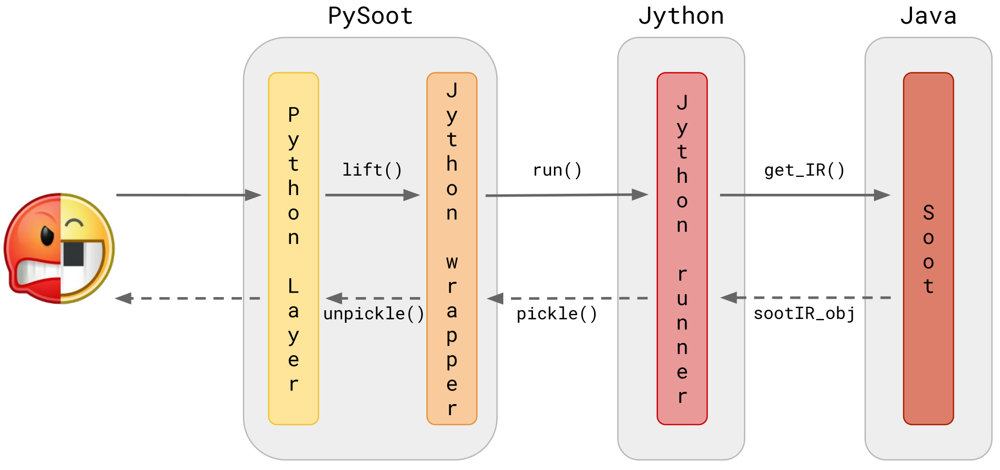

PySoot
======

`pysoot` is a lifter from JAR/APK files to a Soot-like Python IR.

The `master` branch supports Python 3, the `py2k` branch supports Python2.

# Installation
`pip install -e .`

# How to use
```Python 3
from pysoot.lifter import Lifter
input_file = "tests/test_samples/simple1.jar" # the jar/apk you want to analyze
lifter = Lifter(input_file) # the default IR is Shimple, the default input_format is jar
classes = lifter.classes # get the IR of all the classes (as a dict of classes)
print(classes[list(classes.keys())[0]]) # print the IR of one of the translated classes
```

Many other examples are in `tests/test_pysoot.py`

`lifter.soot_wrapper` gives direct access to some Soot functionality.
As of now, I added functions from `Hierarchy.java`, but it is easy (and "almost" automatic) to add others.

# Requirements
* Java. Currently tested using OpenJDK 8 (`sudo apt-get install openjdk-8-jdk`).

Other components used by `pysoot` are:
* `Jython`. Already included in this repo, it is not neccesary to install it. The embedded version "simulates" a virtualenv with `pysoot` installed.
* `soot-trunk.jar`. This is a slightly modified version of the pre-compiled Soot JAR. At some point, I will upload its source code and the compilation script somewhere.
`pysoot` should also work with a normal version of `soot-trunk.jar`.

# Internals
#### Components
`pysoot` works by running Soot (compiled in the embedded `soot-trunk.jar`) using Jython (embedded) and the code in `soot_manager.py`

`jython_wrapper.py` and `jython_runner.py` establish an IPC bi-directional channel which allows a Python process to call methods of an instance of a class in Jython (data is serialized/deserialized using `pickle`).
`jython_wrapper.py` runs in Python, while `jython_runner.py` runs in Jython.
In the future we could release this IPC-layer as a separate component.

`lifter.py` uses this IPC channel to ask Jython to create and serialize the IR.

Classes in `pysoot.sootir` are used both by the Jython code and the Python one.

#### Data-Flow Overview
Python --> `lifter.py` --> `jython_wrapper.py` --> Jython --> `jython_runner.py` --> `soot_manager.py` --> Soot --> Soot IR

Jython --> Soot IR --> `classes in pysoot.sootir` --> `jython_runner.py, pickle` --> Python --> `jython_wrapper.py, unpickle` --> `classes in pysoot.sootir` --> `lifter.py`

<br/>



